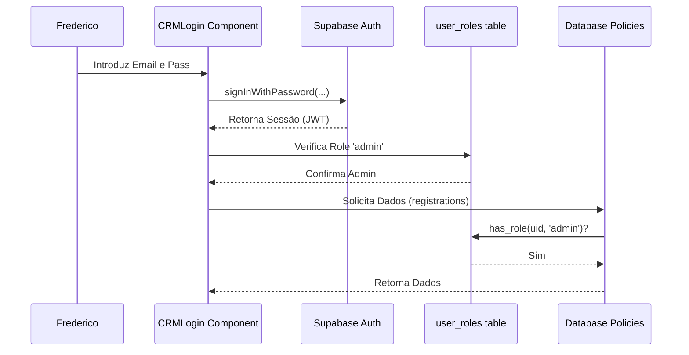

Implementarei um sistema de autenticação real para o CRM, abandonando o sistema baseado em mock e `sessionStorage`. Seguirei as melhores práticas de segurança da Supabase, utilizando o sistema de Roles (Funções) com RLS (Row-Level Security).

### Detalhes Técnicos do Plano:

1.  **Infraestrutura de Banco de Dados (Migração SQL)**:
    *   **Roles**: Criação do enum `public.app_role` com o valor `'admin'`.
    *   **Tabela de Roles**: Criação da tabela `public.user_roles` vinculada ao `auth.users`.
    *   **Função de Segurança**: Implementação da função `has_role(uuid, role)` com `SECURITY DEFINER` para permitir verificações de permissão rápidas e seguras em políticas RLS.
    *   **Políticas de RLS**: Configuração das tabelas sensíveis (`registrations`, `message_logs`, `payment_events`, `invoice_details`, `email_templates`) para que apenas usuários com a role `'admin'` possam visualizar e gerenciar os dados.
    *   **Atribuição Automática**: Criação de um trigger que atribui automaticamente a role `'admin'` a qualquer usuário que se registe com o email `fredericodigital@gmail.com`.

2.  **Componente de Login (`CRMLogin.tsx`)**:
    *   Substituição da lógica manual por `supabase.auth.signInWithPassword`.
    *   Alteração do campo "Chave CRM" para "Palavra-passe".
    *   Tratamento de erros de autenticação (ex: credenciais inválidas).

3.  **Página Principal do CRM (`CRM.tsx`)**:
    *   Mudança da gestão de estado de `sessionStorage` para `supabase.auth.onAuthStateChange`.
    *   Adição de uma verificação de role após o login para garantir que apenas administradores acedam à interface.

4.  **Hook de Dados (`useInscritos.ts`)**:
    *   Remoção da dependência da "CRM Key" (secret) no `localStorage`.
    *   Atualização da função `deleteInscrito` para enviar o token de autenticação (JWT) no cabeçalho `Authorization` em vez do segredo estático.

5.  **Backend Function (`delete-registration`)**:
    *   Atualização da Edge Function para validar o JWT do utilizador.
    *   Verificação direta na tabela `user_roles` para confirmar se o utilizador que solicita a eliminação tem permissões de administrador.

### Fluxo de Trabalho:
- Primeiro, executarei a migração do banco de dados para garantir que o sistema de permissões esteja pronto.
- Em seguida, atualizarei as Edge Functions.
- Por fim, farei as alterações no Frontend para integrar com o sistema de autenticação real.

**Nota**: Como não posso criar utilizadores diretamente na base de dados `auth` com passwords em texto limpo via migração por motivos de segurança (a Supabase usa hashes complexos), o utilizador `fredericodigital@gmail.com` será automaticamente promovido a administrador assim que fizer o login/signup no sistema.

---

